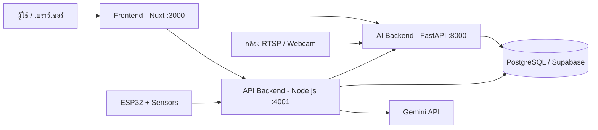

# PH Detection System — Heat Stress Intelligence for Dairy Farms

> Project for **"True AI for All" Hackathon** (Agriculture & Food)

ระบบประเมินและแจ้งเตือนภาวะเครียดจากความร้อน (**Heat Stress**) ในโคนม ด้วยสถาปัตยกรรม **Multimodal AI** (Computer Vision + IoT + Predictive Model) เพื่อช่วยเกษตรกรรายย่อยในประเทศไทย ลดความสูญเสียทางเศรษฐกิจ และสร้างภูมิคุ้มกันทางการเงิน

---

## ภาพรวมโครงการ (Project Overview)

| หัวข้อ | รายละเอียด |
|---|---|
| **ปัญหา** | Heat Stress ทำให้ผลผลิตน้ำนมลดลงมากกว่า 20% โดยมีความหน่วง (Lag effect) 3–7 วัน และเซนเซอร์สวมใส่แบบสากลมีราคาแพงเกินกว่าเกษตรกรรายย่อยจะเข้าถึงได้ |
| **กลุ่มเป้าหมาย** | เกษตรกรผู้เลี้ยงโคนมรายย่อยในไทย ซึ่งกว่า 70% เป็นผู้สูงวัยและมีข้อจำกัดด้านทักษะดิจิทัล |
| **เป้าหมาย** | ระบบต้นทุนต่ำ ไม่สัมผัสตัวสัตว์ (Non-invasive) แจ้งเตือนล่วงหน้าด้วยภาษาที่เข้าใจง่าย และเก็บสถิติเพื่อเพิ่มโอกาสเข้าถึงแหล่งทุน |

---

## สถาปัตยกรรมระบบ 3 ชั้น (3-Layer Architecture)

ออกแบบด้วยแนวคิด **Edge-to-Cloud**

### 1. Sense — การรับรู้ข้อมูลแบบพหุวิถี
- **Environmental IoT:** ESP32-S3 (N16R8) + AHT20 (อุณหภูมิ/ความชื้น) + BMP280 (ความดัน) เพื่อคำนวณค่า **THI** (Temperature-Humidity Index)
- **Computer Vision:** IP Camera (RTSP) หรือ Webcam ส่งภาพเข้าโมเดล **YOLO** เพื่อตรวจจับพฤติกรรมโค (ยืน, นอน, กิน, ดื่ม, หอบ) ใช้ยืนยันว่าเกิดความเครียดจริง

### 2. Recommend — การวิเคราะห์และให้คำแนะนำ
- **Predictive AI (LSTM):** ใช้ข้อมูล Time-series ของ THI และสภาพอากาศ ทำนายความเสี่ยง Heat Stress ล่วงหน้า
- **Context-aware GenAI (Gemini):** แปลงข้อมูลสถิติเป็นคำแนะนำที่เข้าใจง่าย เช่น "เปิดพัดลมและเพิ่มน้ำสะอาด"
- **Delivery:** แจ้งเตือนผ่าน LINE Messaging API / Telegram

### 3. Capitalize — การสร้างสินทรัพย์จากข้อมูล
- **Digital Logbook:** จัดเก็บประวัติ THI และพฤติกรรมโคบน PostgreSQL (Supabase)
- **Financial Inclusion:** ใช้ Data Log เป็นหลักฐานประกอบการขอสินเชื่อ หรือเคลมประกันภัยอิงดัชนีสภาพอากาศ (Weather Index Insurance)

---

## 🧩 สถาปัตยกรรมซอฟต์แวร์ (Microservices)



| Service | Container | Port | หน้าที่ |
|---|---|---|---|
| `frontend` | `cow_detect_frontend` | `3000` | Landing page + Dashboard (Nuxt + Vuetify) |
| `backend` | `cow_detect_backend` | `8000` | YOLO inference, Camera stream (FastAPI) |
| `backend_node` | `cow_detect_node` | `4001` | Business API, Auth, GenAI, Sensor data (Express) |

> [!NOTE]
> ทุก service อยู่บน Docker network `app-network` จึงเรียกหากันด้วยชื่อ service ได้ เช่น `backend_node` เรียก FastAPI ผ่าน `http://backend:8000`

---

## 💻 เทคโนโลยีที่ใช้ (Tech Stack)

| ส่วน | เทคโนโลยี |
|---|---|
| **Frontend** | Nuxt 4, Vue 3, Vuetify 4 (`vuetify-nuxt-module`), ApexCharts, VueUse, `@nuxtjs/supabase` |
| **AI Backend** | FastAPI, Uvicorn, Ultralytics YOLO, OpenCV (headless), SQLAlchemy, Pydantic Settings |
| **API Backend** | Node.js, Express 5, Supabase JS, JWT, bcrypt, `@google/generative-ai`, nodemon |
| **Database** | PostgreSQL (Supabase) + PgBouncer, TimescaleDB (แผนสำหรับ Time-series) |
| **AI / ML** | YOLO (custom `best.pt`), LSTM (Time-series), Gemini (GenAI) |
| **Hardware** | ESP32-S3 N16R8, AHT20, BMP280, IP Camera / USB Webcam |
| **Infrastructure** | Docker & Docker Compose |

---

## 📂 โครงสร้างโปรเจกต์ (Project Structure)

```text
testYOLO26/
├── docker-compose.yml        # รวมทุก service
├── .env                      # ตัวแปรกลาง (ไม่ถูก commit)
├── .gitignore
│
├── backend/                  # 🐍 AI Backend (FastAPI)
│   ├── app/
│   │   ├── api/
│   │   │   ├── detect.py     # POST /api/detect/image
│   │   │   └── test_cam.py   # GET  /api/cam/stream
│   │   ├── core/             # Config / Middleware
│   │   ├── db/               # Database connection & models
│   │   ├── services/
│   │   │   └── yolo_service.py   # โหลดโมเดล YOLO (Singleton)
│   │   ├── weights/          # ไฟล์โมเดล *.pt (ไม่ถูก commit)
│   │   └── main.py           # FastAPI entry point
│   ├── train.py              # สคริปต์เทรนโมเดล
│   ├── requirements.txt
│   └── Dockerfile
│
├── backend_node/             # 🟩 API Backend (Express)
│   ├── app/
│   │   ├── config/
│   │   ├── controllers/
│   │   ├── middleware/
│   │   └── routes/
│   ├── server.js             # Express entry point
│   ├── package.json
│   └── Dockerfile
│
└── frontend/                 # 🟢 Frontend (Nuxt)
    ├── app/
    │   ├── app.vue
    │   ├── layouts/default.vue   # Header / Navbar / Mobile drawer
    │   ├── pages/index.vue       # Landing page (Home)
    │   ├── components/
    │   └── plugins/apexcharts.client.ts
    ├── public/
    │   ├── images/               # bg, logo
    │   └── fonts/                # ฟอนต์ภาษาไทย / อังกฤษ
    ├── nuxt.config.ts
    └── Dockerfile
```

---

## การติดตั้งและการรันระบบ (Getting Started)

### สิ่งที่ต้องมี
- Docker Desktop
- ไฟล์โมเดล YOLO (`best.pt`) วางไว้ที่ `backend/app/weights/best.pt`

### 1. ตั้งค่า Environment Variables

สร้างไฟล์ `.env` ที่ root, `backend/.env` และ `backend_node/.env`

```env
# .env (root) — ใช้โดย docker-compose
SUPABASE_URL=https://<your-project>.supabase.co
SUPABASE_KEY=<your-anon-key>
GEMINI_API_KEY=<your-gemini-key>
DATABASE_URL=postgresql://<user>:<password>@<host>:6543/postgres
```

> [!CAUTION]
> ห้าม commit ไฟล์ `.env` ขึ้น Git เด็ดขาด (มีใน `.gitignore` แล้ว) หากเผลอ push ไปแล้วให้ใช้ `git rm --cached .env` และเปลี่ยนคีย์ใหม่

### 2. รันทุก service ด้วย Docker Compose

```bash
docker compose up --build
```

| URL | รายละเอียด |
|---|---|
| http://localhost:3000 | Frontend |
| http://localhost:8000/docs | Swagger UI ของ FastAPI |
| http://localhost:4001 | Node.js API |

คำสั่งที่ใช้บ่อย:

```bash
docker compose restart frontend      # รีสตาร์ทหลังแก้ .env
docker compose logs -f backend       # ดู log ของ service
docker compose down                  # หยุดทั้งหมด
```

> [!TIP]
> Frontend และ Node ใช้ anonymous volume `/app/node_modules` หากเพิ่ม package ใหม่แล้วไม่เจอ ให้รัน `docker compose up --build -V` เพื่อสร้าง volume ใหม่

### 3. (ทางเลือก) รัน Backend แบบไม่ใช้ Docker

```bash
cd backend
python -m venv venv
source venv/bin/activate          # Windows: venv\Scripts\activate
pip install -r requirements.txt
uvicorn app.main:app --reload --port 8000
```

---

## 🔗 API Endpoints

### AI Backend — FastAPI (`:8000`)

| Method | Path | รายละเอียด | สถานะ |
|---|---|---|---|
| `GET` | `/` | ตรวจสอบสถานะ Server | ✅ |
| `POST` | `/api/detect/image` | อัปโหลดภาพ → YOLO → คืน Bounding Box, Confidence, Class (JSON) | ✅ |
| `GET` | `/api/cam/stream` | MJPEG Stream จาก Webcam/RTSP พร้อมตีกรอบพฤติกรรมแบบ Real-time | ✅ |

### API Backend — Node.js (`:4001`)

| Method | Path | รายละเอียด | สถานะ |
|---|---|---|---|
| `GET` | `/` | ทดสอบการเชื่อมต่อ (`Connect node success!`) | ✅ |
| `POST` | `/api/sensors/data` | รับค่าอุณหภูมิ/ความชื้น/ความดันจาก ESP32 | 🚧 |
| `POST` | `/api/auth/*` | สมัครสมาชิก / เข้าสู่ระบบ (JWT) | 🚧 |

---

## 🗺 Roadmap

- [x] Train custom YOLO model สำหรับพฤติกรรมโคนม
- [x] FastAPI รองรับ Image detection และ Video streaming
- [x] ตั้งค่า Microservices ด้วย Docker Compose (FastAPI + Node.js + Nuxt)
- [x] Landing page (Nuxt + Vuetify) พร้อม Smooth scroll และ Scroll reveal animation
- [ ] Endpoint รับข้อมูลจาก ESP32 (Temperature, Humidity, Pressure)
- [ ] เชื่อมต่อ PostgreSQL / Supabase สำหรับ Digital Logbook
- [ ] ระบบ Auth (JWT) ฝั่ง Node.js
- [ ] โมเดล LSTM คาดการณ์แนวโน้มค่า THI ล่วงหน้า
- [ ] Dashboard แสดงผล Real-time สำหรับเกษตรกร
- [ ] GenAI (Gemini) สร้างคำแนะนำ + แจ้งเตือนผ่าน LINE Messaging API

---

## 📚 อ้างอิง (References)

1. Mulajkar et al. (2026). *Artificial Intelligence for Early Detection of Heat Stress and Environmental Hazards in Dairy Animals.*